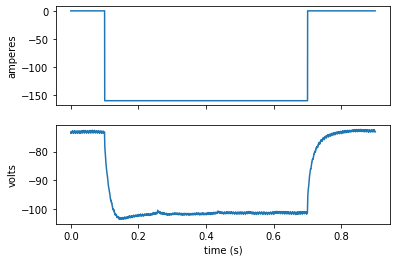
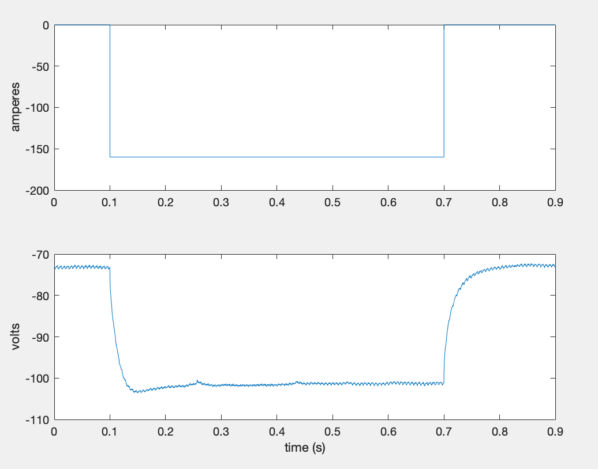

# tolias-lab-to-nwb
Code for converting Tolias Lab data to NWB. The text metadata is stored in a YAML file, and must be edited with the correct fields to be added to the NWB file.

## Installation
```shell script
pip install tolias-lab-to-nwb
```

## Usage
in python:
```python
import os

from dateutil import parser
from ruamel import yaml
from scipy.io import loadmat

from tolias_lab_to_nwb.convert import ToliasNWBConverter
from tolias_lab_to_nwb.data_prep import data_preparation

input_fpath = '/path/to/08 01 2019 sample 1.mat'
output_fpath = 'path/to/dest.nwb'
metafile_fpath = 'path/to/metafile.yml'

fpath_base, fname = os.path.split(input_fpath)
session_id = os.path.splitext(fname)[0]

with open(metafile_fpath) as f:
    metadata = yaml.safe_load(f)

metadata['NWBFile']['session_start_time'] = parser.parse(session_id[:10])
metadata['NWBFile']['session_id'] = session_id

tolias_converter = ToliasNWBConverter(metadata)

data = loadmat(input_fpath)
time, current, voltage, curr_index_0 = data_preparation(data)

tolias_converter.add_icephys_data(current, voltage, rate=25e3)

tolias_converter.save(output_fpath)
```

in command line:
```
usage: convert.py [-h] [-o OUTPUT_FPATH] [-m METAFILE] input_fpath

convert .mat file to NWB

positional arguments:
  input_fpath           path of .mat file to convert

optional arguments:
  -h, --help            show this help message and exit
  -o OUTPUT_FPATH, --output_fpath OUTPUT_FPATH
                        path to save NWB file. If not provided, file will
                        output as input_fname.nwb in the same directory 
                        as the input data.
  -m METAFILE, --metafile METAFILE
                        YAML file that contains metadata for experiment. 
                        If not provided, will look for metafile.yml in the
                        same directory as the input data.

example usage:
  python -m tolias_lab_to_nwb.convert '/path/to/08 01 2019 sample 1.mat'
  python -m tolias_lab_to_nwb.convert '/path/to/08 01 2019 sample 1.mat' -m path/to/metafile.yml
  python -m tolias_lab_to_nwb.convert '/path/to/08 01 2019 sample 1.mat' -m path/to/metafile.yml -o path/to/dest.nwb
```

### Reading the resulting NWB files in python

```python
from pynwb import NWBHDF5IO
import numpy as np
import matplotlib.pyplot as plt

fpath = 'path/to/08 01 2019 sample 1.nwb'

io = NWBHDF5IO(fpath, 'r')

nwb = io.read()

def plot_sweep(sweep, ax=None):
    if ax is None:
        _, ax = plt.subplots()
    dat = sweep.data[:]
    yy = dat * sweep.conversion
    xx = np.arange(len(dat))/sweep.rate
    
    ax.plot(xx, yy)
    
    ax.set_ylabel(sweep.unit)
    ax.set_xlabel('time (s)')

def get_stim_and_response(nwb, stim_name):
    stimulus = nwb.stimulus[stim_name]
    df = nwb.sweep_table.to_dataframe()
    stim_select = df['series'].apply(lambda x: x[0].object_id) == stimulus.object_id
    sweep_number = df['sweep_number'][stim_select].values[0]
    resp_select = df['sweep_number'] == sweep_number - stim_select
    response = df['series'][resp_select].values[0][0]
    return stimulus, response

stimulus, response = get_stim_and_response(nwb, 'CurrentClampStimulusSeries002')

fig, axs = plt.subplots(2,1, sharex=True)
plot_sweep(stimulus, ax=axs[0])
plot_sweep(response, ax=axs[1])
_ = axs[0].set_xlabel('')
```



### reading data in MATLAB

```matlab
%% read

fpath = '/Volumes/easystore5T/data/Tolias/08 01 2019 sample 1.nwb';

nwb = nwbRead(fpath);

stim_name = 'CurrentClampStimulusSeries002';

stimulus = nwb.stimulus_presentation.get(stim_name);

sweep_table = nwb.general_intracellular_ephys_sweep_table;

sweep_numbers = sweep_table.sweep_number.data.load;

for i = 1:length(sweep_table.series.data)
    obj = sweep_table.series.data(i);
    if obj.refresh(nwb) == stimulus
        sweep_number = sweep_numbers(i);
        break;
    end
end

ind = find(sweep_numbers == sweep_number);
ind = ind(ind ~= i); % remove stim ind

response = sweep_table.series.data(ind).refresh(nwb);

%% plot

yy = stimulus.data.load * stimulus.data_conversion;
xx = (1:length(yy)) / stimulus.starting_time_rate;

subplot(2,1,1)
plot(xx,yy)
ylabel(stimulus.data_unit)


yy = response.data.load * stimulus.data_conversion;
xx = (1:length(yy)) / response.starting_time_rate;

subplot(2,1,2)
plot(xx,yy)
ylabel(response.data_unit)
xlabel('time (s)')
```

